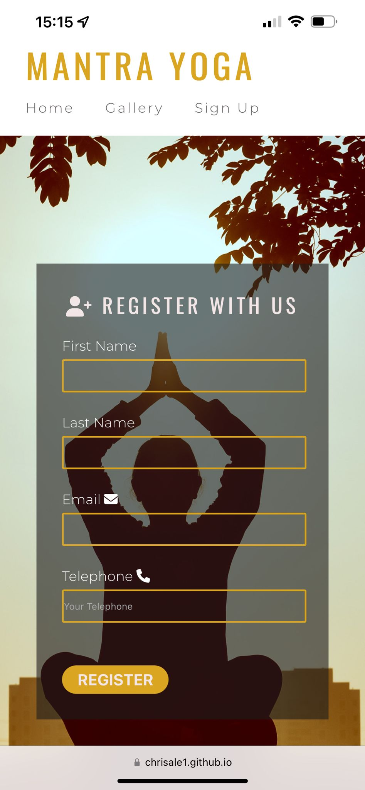

# First Project 
You can view live project [here](https://chrisale1.github.io/mantra-yoga/)

This is a website about a yoga studio. It shows some different yoga techniques, gallery of some members participating in yoga class and also a page to signup. this website is also available in different devices and easy to navigate.

This is a desktop view of home page

Mobile screen shoot of page
 

## <b>User Experience UX

### . User story

. A person visiting the site for the first time, will find ot easy to understand and navigate.

. First time visitor will be able to understand the purpose of the site.

. User will be able to find a way to contact organization.

.user will easily be able to follow us on social media links by click on the social media icons

## Technology used 

. HTML5 : Html5 was mostly used on the this project as the the basic structure and content of the pages

. CSS3 : Css3 was used to styled and also make the web pages responsive 

### Liberaries & Programs used

 . Google fonts: Google fonts was used to import fonts from google used throghout the page [montserrat, Oswald] was used.

. Font Awesome: Font awesome was used to add icons through out the site.

. Github: Github was used to upload and store the project.

. Git: Git was used in uploading different version of the project on github.

. Window Resizer : window resizer was use to check different size of the screen in different screen size

## TESTING

Each HTML5 pages was with tested [W3C Markup Validator-Results](https://validator.w3.org/) and sintax error was fixed also CSS page was also tested with [W3C CSS Validator-Results](https://jigsaw.w3.org/css-validator/validator).

when testing for responsiviness in different devices. I had problems with the navigation links fiting into small mobile screen. So i had to reduce the margin from left from both the logo and navigation link.

Also on problems with fiting contents of the yoga techniques in the box when screen size is reduced so height of the div was increase.

Testing on responsiviness was done on various mobile devices with different screen size, tablets, laptops  and desktop. Also window resizer was used to check for different screen size.

## Deployment

In deploying my website, i login to my github and opened the Repositories where i have  my project[ Chrisale1 /
mantra-yoga
](https://github.com/Chrisale1/mantra-yoga). Click on the setting button

By the left handside of the screen i clicked on pages. Click on Source and a dropdown menu show and selected deploy from a branch. 

Scroll down  to branch and click on it for the dropdown menu to show and select main branch and on the second dropdown selected roots and save and the page refresh and a create a [link](https://chrisale1.github.io/mantra-yoga/) to use to deploy project. I copied the link and tried on different browser and mobile devices to see if it work and it worked perfectly.

## CREDIT

### Content
For an idea of what i should add on my project i checked fellow website of yoga studio like https://www.numad.es/, https://yogaencastellon.com/#iyeng,https://www.healthline.com/health/fitness-exercises/types-of-yoga#Hatha and got some idea there.

### Media
Pictures used on the pages of the site were downloaded from website like [Unsplash](https://unsplash.com/), [Pexels](https://www.pexels.com/).

## Acknowledgments

My goal was to use what i learned from code institute and use it to create a simple web page for this project, and i got a lot of idea. I would like to thanks  codeinstitut/learnig peopleteam and mentor. W3school and stackoverflow was also used when i was stucked.

